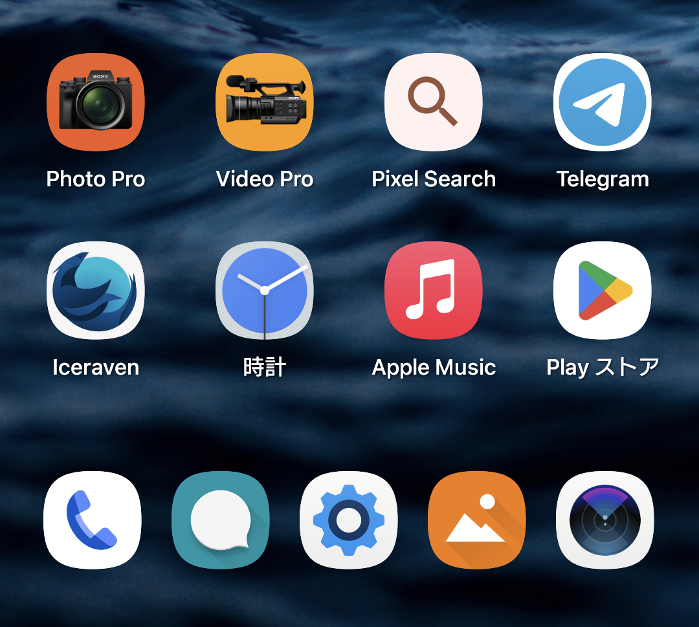

&nbsp;

# MeeGo Icon Shape Magisk Module for Android 12

&nbsp;

&nbsp;

## Feature:

Replace system’s Adaptive Icon’s shape to MeeGo Harmattan shape. Everyone loves Nokia N9’s design.

## Download

Head to [release page](https://github.com/yeyebbc/MeeGo-Adaptive-Icon-Shape-Magisk-Module/releases).

## Requirements & Warning:

- Magisk installed.
- Android 12 (maybe)
  Tested on Android 12, for other versions test it on your own. If it boot loops, boot into safe mode then reboot again to remove the module.

> &nbsp; > **Enter safe mode with device buttons**
>
> Power your phone up with the power button, and hold the power button until you see an animated logo appear.
> Hold the Volume Down button once you see the animated logo appear.
> Continue holding Volume Down until your device vibrates then reboots.
> This should boot your phone into safe mode.
> &nbsp;

## Credit

- Nokia Design Team
- CoolAPK user @天伞桜’s original module on which this module is based
